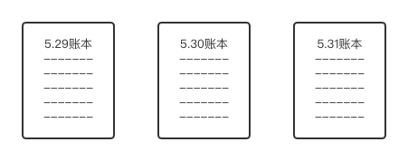
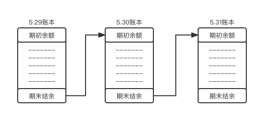

区块链=区块+链。
<br/>为了理解区块和链的概念，我们先讲一段故事。

## 记账的故事
假设有一个村子，这个村子并没有实体货币的存在，所有的交易都是靠大家记账实现的。

<br/>例如老王是一个卖肉的商人，有一天小明想要找老王买100块钱的肉，那么为了让这笔交易被大家承认，他们找到村里的广播，发布了一个公告说：“小明的账户减少100块，老王的账户增加100块。”这时大家拿出自己的账本，把这条交易信息记录下来。

<br/>时间久了人们发现自己随时随地都在不停的记账，并且大部分交易跟自己无关，这是一件非常麻烦的事情，这时候大家提出，由村长来负责记账，所有的交易会由村长整理记录，并在每天傍晚的时候贴到公告栏，供大家检查是否有问题，如果大家公认账本没有问题，那么就会拿出自己的账本记录一份带回家保存，这样村子每天就会产生一个当天的账本，比如```5月29日账本```、```5月30日账本```、```5月31日账本```：



这些账本都是独立存在的，因此每个账本都可以看作是一个```区块```，区块就是如此形成的，每一个区块可以理解为多条账目的一个打包。

<br/>村子进行了一天的交易后，村长在整理账本时会将每个人的交易进行整理，这样就得到了每个人的一个```期末结余```，而在第二天时，村长会把昨天的```期末结余```放到当天账本的开端，作为当期账本的```期初余额```，这时我们发现，通过昨天的账本和今天账本结转余额的方式，两个账本（也就是两个区块）被联系在了一起：



这就形成了账本之间，也就是区块之间的```链```。

<br/>又经过一段时间，村长不乐意了，现在村长每天只顾着记账了，他自己的收入从哪里来呢，于是大家为了让村长能继续为大家记账，同意每一笔交易都给村长一块钱作为记账的报酬，这一块钱，就是交易的手续费。很快大家又发现一个事实，村长每天处理500笔交易，可以获得500块钱，而自己搬砖一天只能赚150块钱，于是大家都想做这个记账的人，那么选谁来做这个记账的人才能让大家都满意呢，这时候大家商定了一个规则，规定每个人抛硬币20次，谁抛出来的正面最多，谁就负责记账，大家觉得这个规则比较公平，所以达成了共识，那么这就被称为```共识机制```。

<br/>现在村子里的交易规则已经运行的非常好，但是又遇到了一个问题，有些人住在村子的边远地区，每天需要到村子中心的公告栏来抄写账本，非常的不方便，那这怎么办呢，其实也很简答，他去抄邻居的账本就行了，而邻居还可以抄邻居的邻居的账本，因为账本可以互相的查看，也就不需要所有人挤破脑袋去公告栏抄写账本，还可以跟所有邻居核对账本信息，这时候村里的每个人都与邻居之间互相交换信息，本质上构建了一个点对点传播网络，这种信息传播方式也就是区块链的网络路由方式，每个村民就构成了整个网络中的一个```节点```。

<br/>现在思考另一个问题，那就是如果现在有人想篡改这个账本，例如有村民想为自己添加一笔不存在的交易收入，这其实难度是非常大的，因为每个人手里都有一个账本，对比账本集中在少数人手里的模式，这种```分布式账本```的模式下如果想要改变一笔交易，你需要将每个人手里的账本都修改一遍，而这就是区块链防篡改的逻辑本质。

## 概念复盘
我们回到区块链的基本概念上，理解了上面的故事，就可以直观的来说明区块链的一些基本特征：
- 区块：每隔一段时间生成的账本；
- 链：通过携带前一个账本的结余信息来链接当前账本与前一个账本的数据；
- P2P网络路由：村子里的每个人都与邻居交换信息；
- 分布式账本：村里的每个人都有一套完整的账本，去中心化，公开透明；
- 共识机制：通过商定的规则来选择谁来进行记账；
- 防篡改：需要将每个人手里的账本都进行修改才能使篡改生效。

## 隐私问题
到这里区块链的原始样貌已经逐渐清晰了，但随之而来的另一个重要问题也浮出水面，我们现实生活中，有时候并不想让其他人知道我们的交易细节和金额，使用普通的结余链接的方式并不能满足这样的隐私需求。区块链的发明者考虑到了这样的情况，并提出了一个聪明的方案，我们可以用某种算法给每次交易都生成一个唯一代号，而为了使交易之间的关联信息不丢失，在生成代号的算法中加入前一次交易的代号共同生成本次代号，这样我们在每个区块中写入上个区块最后一次交易的代号，就实现了区块的链接。

<br/>上文这种生成交易代号的功能，被称作区块链数据```哈希```。